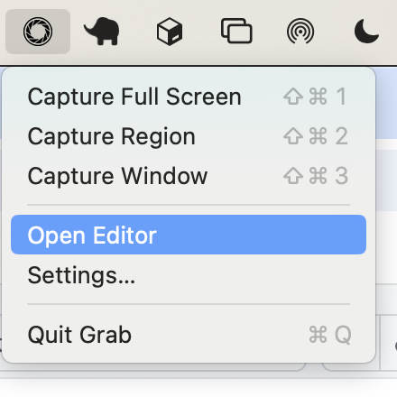
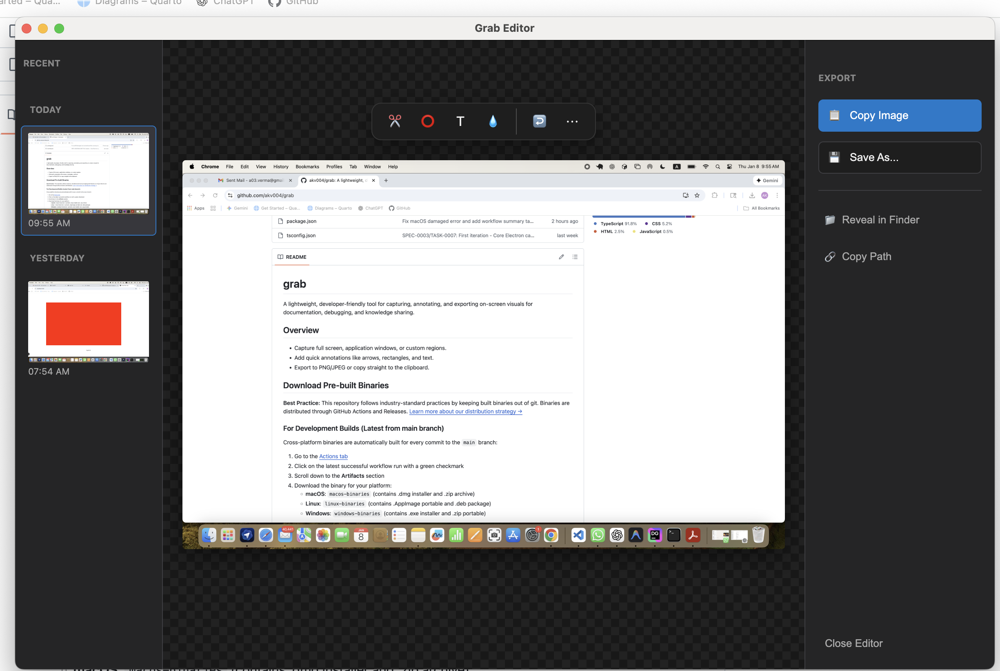

<div align="center">
  
  
  # grab
  
  A lightweight, developer-friendly tool for capturing, annotating, and exporting on-screen visuals for documentation, debugging, and knowledge sharing.
</div>

## Overview
- Capture full screen, application windows, or custom regions.
- Add quick annotations like arrows, rectangles, and text.
- Export to PNG/JPEG or copy straight to the clipboard.

## Screenshots

<div align="center">
  
  <p><em>Grab Application Icon</em></p>
</div>

<div align="center">
  
  <p><em>Grab Application Icon</em></p>
</div>

<!-- Application screenshots will be added here -->

## Download Pre-built Binaries

**Best Practice:** This repository follows industry-standard practices by keeping built binaries out of git. Binaries are distributed through GitHub Actions and Releases. [Learn more about our distribution strategy →](docs/DISTRIBUTION.md)

### For Development Builds (Latest from main branch)
Cross-platform binaries are automatically built for every commit to the `main` branch:

1. Go to the [Actions tab](https://github.com/akv004/grab/actions/workflows/build.yml)
2. Click on the latest successful workflow run with a green checkmark
3. Scroll down to the **Artifacts** section
4. Download the binary for your platform:
   - **macOS**: `macos-binaries` (contains .dmg installer and .zip archive)
   - **Linux**: `linux-binaries` (contains .AppImage portable and .deb package)
   - **Windows**: `windows-binaries` (contains .exe installer and .zip portable)

**Note**: Development build artifacts are retained for 90 days.

### For Stable Releases
When a version tag (e.g., `v1.0.0`) is pushed:
1. Go to the [Releases page](https://github.com/akv004/grab/releases)
2. Download the binary for your platform from the latest release

### Platform-Specific Distribution Formats

**macOS:**
- `.dmg` - Standard macOS disk image installer
- `.zip` - Portable archive

**Important for macOS users:** If you encounter a "damaged and can't be opened" error from Gatekeeper, run this command in Terminal:
```bash
sudo xattr -dr com.apple.quarantine "/Applications/grab.app"
```

**Linux:**
- `.AppImage` - Universal portable format (no installation required)
- `.deb` - Debian/Ubuntu package

**Windows:**
- `.exe` - NSIS installer (recommended)
- `.zip` - Portable archive

## For Developers

For development documentation and AI agent guidelines, see:
- **[AI Agent Development Guide](docs/README_AI.md)** - Complete guide for working with AI agents and the spec-based development system
- **[Documentation Index](docs/README.md)** - Full documentation structure
- **[Getting Started](docs/GETTING_STARTED.md)** - Spec-based workflow overview
