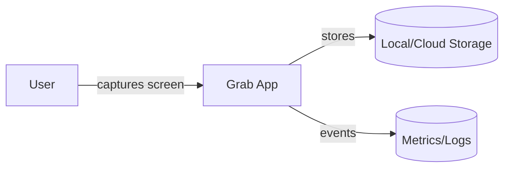

# Architecture Overview

> Placeholder system diagram (Mermaid):

## Key Components
- **Capture Engine**: Handles screen/window capture and buffering.
- **Annotation Layer**: Adds overlays, shapes, and text to captures.
- **Export Pipeline**: Saves to disk or shares to integrations; handles formats and compression.
- **Settings & Profiles**: User preferences, shortcuts, storage targets.
- **Telemetry & Observability**: Logging, metrics, and tracing hooks.

## Boundaries & Integrations
- OS screen-capture APIs (platform-specific permissions).
- Local filesystem and optional cloud storage.
- External sharing/integration endpoints (abstracted behind adapters).

Refer to ADRs in `adr/` for key decisions; update this overview as the system evolves.
