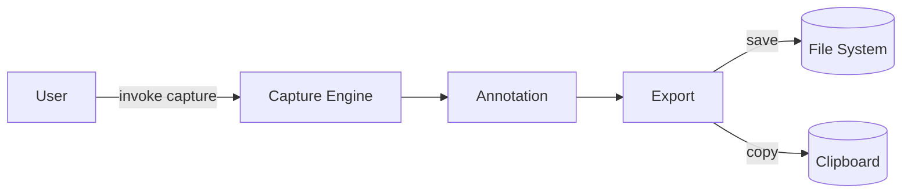

# SPEC-0001: Screen Capture MVP
- **Status**: In Progress
- **Owner**: TBD
- **Target Release**: TBD
- **Created**: 2026-01-02
- **Updated**: 2026-01-02
- **Linked Tasks**: TASK-0001, TASK-0002, TASK-0003

## 1. Summary
Deliver a minimal but usable screen capture experience that can capture full screen, windows, or regions with basic annotation and export options.

## 2. Problem / Motivation
Users need a lightweight tool to capture on-screen visuals quickly, annotate them, and share or store outputs without heavy UI overhead.

## 3. Goals
- Capture full screen, window, and region reliably.
- Provide simple annotation tools (shapes/text).
- Export captures to common formats and destinations.

## 4. Non-Goals
- Advanced editing (layers, complex effects).
- Cloud account management or complex sharing flows.

## 5. User Stories / Use Cases
- As a user, I can capture a region to share a bug reproduction.
- As a user, I can annotate a capture with arrows/text and export to PNG.
- As a user, I can quickly copy a capture to clipboard without saving.

## 6. Requirements
### Functional Requirements
1. FR-1: Capture full screen. [DONE]
2. FR-2: Capture a selectable region with drag handles. [PENDING - Fallback implemented]
3. FR-3: Capture a chosen application window. [PENDING - Fallback implemented]
4. FR-4: Provide basic annotations (arrow, rectangle, text). [MOVED to SPEC-0004]
5. FR-5: Export to PNG/JPEG and copy to clipboard. [DONE]

### Non-Functional Requirements
- Performance: Capture and export within 1s for 1080p screens on target hardware.
- Security: Avoid capturing protected windows as enforced by OS; no network exfiltration.
- Reliability: No crashes across 10 consecutive captures.

## 7. UX / UI (if applicable)
Minimal capture overlay with handles; annotation toolbar appears after capture. No persistent chrome.

## 8. API Contract (if applicable)
N/A for MVP; local-only interactions.

## 9. Data Model / Storage
Temporary in-memory buffers; optional save to user-selected folder.

## 10. Architecture / Flow

## 11. Edge Cases & Error Handling
- OS blocks protected content → show friendly message.
- Capture fails → retry prompt and error log entry.
- Low disk space during export → surface error and keep capture in memory.

## 12. Observability (logs/metrics/traces)
Log capture start/end, failures, export success/failure; metric counters for capture modes; optional timing metrics.

## 13. Security & Privacy considerations
Respect OS capture restrictions; avoid logging pixel data; ensure clipboard cleared on user request.

## 14. Testing Plan (unit/integration/e2e)
- Unit: capture helpers, annotation operations, export formatting.
- Integration: capture to annotation to export pipeline.
- E2E: user flows for full screen, region, window; clipboard copy.

## 15. Rollout Plan (feature flags, backward compatibility)
Feature flag per capture mode; staged enablement; fallback to clipboard-only export if file write fails.

## 16. Open Questions
- Which annotation tools are mandatory for MVP? (default: arrow, rectangle, text)
- Default export folder path?

## 17. Acceptance Criteria
- [x] Full screen capture works on target OS.
- [ ] Region and Window capture (Defer to MVP-1.5/Updates).
- [ ] Annotations (Moved to SPEC-0004).
- [x] Clipboard copy and file save succeed for supported formats.

## 18. Change Log
- 2026-01-02: Draft created.
