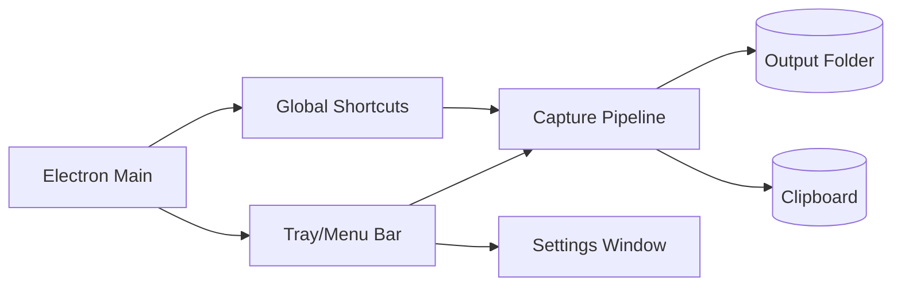

# SPEC-0002: Menu Bar and Shortcuts
- **Status**: Draft
- **Owner**: TBD
- **Target Release**: TBD
- **Created**: 2026-01-02
- **Updated**: 2026-01-02
- **Linked Tasks**: TASK-0004, TASK-0005, TASK-0006

## 1. Summary
Add a native menu bar (macOS) / system tray (Windows/Linux) experience with global shortcuts to trigger screen capture actions without a persistent window.

## 2. Problem / Motivation
Users want quick, unobtrusive access to capture actions without keeping a window open. Global shortcuts must work even when the app is not focused.

## 3. Goals
- Create a tray/menu bar entry with capture and settings actions.
- Register global shortcuts for capture modes.
- Maintain cross-platform compatibility with macOS-first behavior.

## 4. Non-Goals
- Building a complex settings UI; keep minimal.
- Implementing cloud integrations; focus on local capture and clipboard.

## 5. User Stories / Use Cases
- As a macOS user, I can trigger capture from the menu bar or keyboard shortcuts without opening a window.
- As a Windows/Linux user, I can use system tray menu and shortcuts to capture.
- As a user, I can open settings only when needed to change output folder or shortcuts.

## 6. Requirements
### Functional Requirements
1. FR-1: Create a tray/menu bar icon on startup with items: Capture Full Screen, Capture Region, Capture Window, Open Settings, Quit.
2. FR-2: Register global shortcuts: Cmd+Shift+1 (full screen), Cmd+Shift+2 (region), Cmd+Shift+3 (window); must work when unfocused and unregister on quit.
3. FR-3: Capture flows use desktop capture APIs, save to configurable output folder, and copy to clipboard by default.
4. FR-4: Settings window allows changing output folder, remapping shortcuts, toggling clipboard copy; opens only on request.

### Non-Functional Requirements
- Performance: Shortcut → capture initiation within 200ms target on supported hardware.
- Security: Respect OS permissions for screen capture; avoid unauthorized capture.
- Reliability: Shortcuts and tray actions remain functional after sleep/wake; unregister cleanly on quit.

## 7. UX / UI (if applicable)
macOS status bar icon; Windows/Linux tray icon. Menu items listed in order: full screen, region, window, settings, quit. No persistent main window.

## 8. API Contract (if applicable)
N/A; local Electron main/renderer messaging only.

## 9. Data Model / Storage
Preference store for output folder path, shortcut mappings, and clipboard toggle (e.g., JSON in app data).

## 10. Architecture / Flow

## 11. Edge Cases & Error Handling
- Missing screen capture permission → prompt guidance and disable actions.
- Shortcut registration conflict → fall back to alternate binding and note in settings.
- Output folder missing/unwritable → prompt to select new folder and keep clipboard copy.

## 12. Observability (logs/metrics/traces)
Log tray creation, shortcut registration/unregistration, capture attempts/results, settings updates. Metrics for shortcut-triggered captures vs menu-triggered captures.

## 13. Security & Privacy considerations
Honor OS-level capture consent; do not log pixel data; ensure shortcuts cannot bypass permissions. Store preferences in user space with appropriate file permissions.

## 14. Testing Plan (unit/integration/e2e)
- Unit: preference storage, shortcut mapping logic.
- Integration: tray menu actions invoke capture pipeline; shortcuts fire capture handlers.
- E2E: cross-platform smoke tests for menu items and shortcut capture flows.

## 15. Rollout Plan (feature flags, backward compatibility)
Feature flag for tray/shortcut feature; staged enablement per OS; fallback to existing capture triggers if flag off.

## 16. Open Questions
- Should users be able to disable specific shortcuts? Default yes via settings.
- Default output folder per OS?

## 17. Acceptance Criteria
- [ ] Tray/menu bar appears on supported OSes with required items.
- [ ] Shortcuts trigger captures when app unfocused and unregister on quit.
- [ ] Captures save to configured folder and copy to clipboard by default.
- [ ] Settings window updates preferences and persists across restarts.

## 18. Change Log
- 2026-01-02: Draft created.
