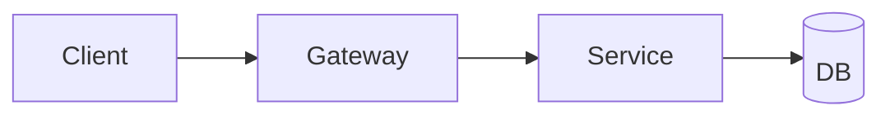

# SPEC-XXXX-api: API Title
- **Status**: Draft | Review | Approved | In Progress | Done | Deprecated
- **Owner**: Name/Handle
- **Target Release**: YYYY-MM
- **Created**: YYYY-MM-DD
- **Updated**: YYYY-MM-DD
- **Linked Tasks**: TASK-XXXX, ...

## 1. Summary
One-paragraph overview of the API change.

## 2. Problem / Motivation
What API gap or integration need is being addressed.

## 3. Goals
- Goal 1

## 4. Non-Goals
- Out of scope 1

## 5. User Stories / Use Cases
- As an integrator, I need ...

## 6. Requirements
### Functional Requirements
1. FR-1 ...
2. FR-2 ...

### Non-Functional Requirements
- Performance (latency/throughput targets)
- Security (authn/z, rate limits)
- Reliability (SLAs, retries)

## 7. UX / UI (if applicable)
Touchpoints in UI clients (if any).

## 8. API Contract (if applicable)
- **Endpoints**: list with verbs and paths.
- **Authentication**: scheme and scopes.
- **Request/Response examples**:
```
POST /v1/example
Headers: Authorization: Bearer <token>
Request: {"field": "value"}
Response: {"id": "123", "status": "ok"}
```
- **Errors**: error codes/messages, rate-limit responses.

## 9. Data Model / Storage
Schemas, migrations, TTL/retention.

## 10. Architecture / Flow


## 11. Edge Cases & Error Handling
Validation rules, idempotency, pagination, concurrency.

## 12. Observability (logs/metrics/traces)
Access logs, structured event fields, metrics (latency, error rate), trace spans.

## 13. Security & Privacy considerations
AuthZ model, data handling, PII protection, audit requirements.

## 14. Testing Plan (unit/integration/e2e)
Contract tests, negative tests, load tests.

## 15. Rollout Plan (feature flags, backward compatibility)
Versioning, headers, staged rollout, rollback steps.

## 16. Open Questions
- Question 1

## 17. Acceptance Criteria
- [ ] Criteria 1

## 18. Change Log
- YYYY-MM-DD: Draft created.
