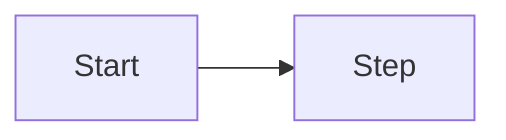

# SPEC-XXXX: Title
- **Status**: Draft | Review | Approved | In Progress | Done | Deprecated
- **Owner**: Name/Handle
- **Target Release**: YYYY-MM
- **Created**: YYYY-MM-DD
- **Updated**: YYYY-MM-DD
- **Linked Tasks**: TASK-XXXX, ...

## 1. Summary
One-paragraph summary of the initiative.

## 2. Problem / Motivation
Why this is needed; business/user value and pain points.

## 3. Goals
- Goal 1
- Goal 2

## 4. Non-Goals
- Not in scope 1
- Not in scope 2

## 5. User Stories / Use Cases
- As a <user>, I want ... so that ...

## 6. Requirements
### Functional Requirements
1. FR-1 ...
2. FR-2 ...

### Non-Functional Requirements
- Performance: ...
- Security: ...
- Reliability: ...

## 7. UX / UI (if applicable)
Wireframes, states, accessibility expectations.

## 8. API Contract (if applicable)
Request/response schema and examples.
```
POST /path
Request: {...}
Response: {...}
```

## 9. Data Model / Storage
Schemas, migrations, retention, indexing.

## 10. Architecture / Flow


## 11. Edge Cases & Error Handling
List edge cases, validation, and error responses.

## 12. Observability (logs/metrics/traces)
Key events, metrics, and trace spans.

## 13. Security & Privacy considerations
Threats, mitigations, permission model, data handling.

## 14. Testing Plan (unit/integration/e2e)
Planned coverage mapped to requirements.

## 15. Rollout Plan (feature flags, backward compatibility)
Steps, flags, migration, rollback.

## 16. Open Questions
- Question 1

## 17. Acceptance Criteria
- [ ] Criteria 1
- [ ] Criteria 2

## 18. Change Log
- YYYY-MM-DD: Draft created.
