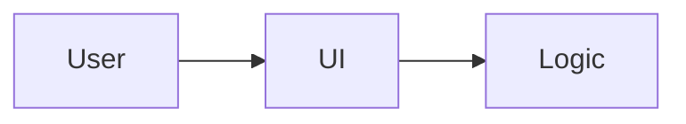

# SPEC-XXXX-ui: UI Title
- **Status**: Draft | Review | Approved | In Progress | Done | Deprecated
- **Owner**: Name/Handle
- **Target Release**: YYYY-MM
- **Created**: YYYY-MM-DD
- **Updated**: YYYY-MM-DD
- **Linked Tasks**: TASK-XXXX, ...

## 1. Summary
One-paragraph overview of the UI change.

## 2. Problem / Motivation
User pain and desired outcome.

## 3. Goals
- Goal 1

## 4. Non-Goals
- Out of scope 1

## 5. User Stories / Use Cases
- As a user, I want ... so that ...

## 6. Requirements
### Functional Requirements
1. FR-1 ...
2. FR-2 ...

### Non-Functional Requirements
- Performance: ...
- Accessibility: ...
- Reliability: ...

## 7. UX / UI
States, flows, accessibility notes.

## 8. API Contract (if applicable)
Data needs to/from backend.

## 9. Data Model / Storage
Local/remote state, persistence.

## 10. Architecture / Flow

## 11. Edge Cases & Error Handling
Boundary cases and user feedback.

## 12. Observability (logs/metrics/traces)
Events, metrics, trace points.

## 13. Security & Privacy considerations
Data handling, permissions, secure defaults.

## 14. Testing Plan (unit/integration/e2e)
Coverage tied to requirements.

## 15. Rollout Plan (feature flags, backward compatibility)
Gating, staged rollout.

## 16. Open Questions
- Question 1

## 17. Acceptance Criteria
- [ ] Criteria 1

## 18. Change Log
- YYYY-MM-DD: Draft created.
